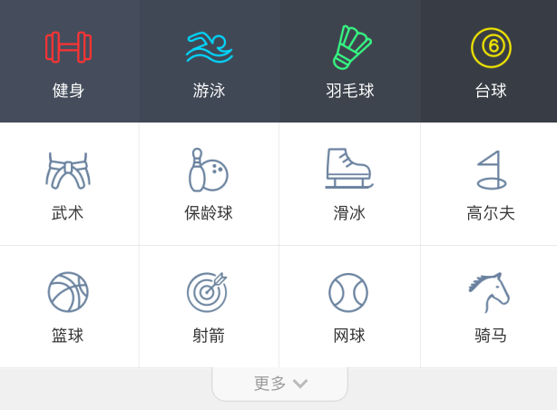

## GridView

### 描述
A scrollable, 2D array of widgets.  
网格布局，一个可滚动的2D排列的小部件。

### 构造函数
```javascript
GridView({
  Key key,
  Axis scrollDirection = Axis.vertical,
  bool reverse = false,
  ScrollController controller,
  bool primary,
  ScrollPhysics physics,
  bool shrinkWrap = false,
  EdgeInsetsGeometry padding,
  @required this.gridDelegate,
  bool addAutomaticKeepAlives = true,
  bool addRepaintBoundaries = true,
  double cacheExtent,
  List<Widget> children = const <Widget>[],
})
scrollDirection：滚动的方向，有垂直和水平两种，默认为垂直方向（Axis.vertical）。
reverse：默认是从上或者左向下或者右滚动的，这个属性控制是否反向，默认值为false，不反向滚动。
controller：控制child滚动时候的位置。
primary：是否是与父节点的PrimaryScrollController所关联的主滚动视图。
physics：滚动的视图如何响应用户的输入。
shrinkWrap：滚动方向的滚动视图内容是否应该由正在查看的内容所决定。
padding：四周的空白区域。
gridDelegate：控制GridView中子节点布局的delegate。
cacheExtent：缓存区域。

同时也提供了如下额外的四种构造方法，方便开发者使用。
GridView.builder
GridView.custom
GridView.count
GridView.extent
```


### 示例  
GridView的布局行为不复杂，本身是尽量占满空间区域，布局行为上完全继承自ScrollView。
<iframe src="./web/index.html" width="280px" height="500px" frameborder="0" scrolling="no"></iframe>

### 主要代码
```javascript
List<Widget> getWidgetList() {
    List<String> list = [];
    for (int i = 0; i < 100; i++) {
      list.add(i.toString());
    }
    return list.map((item) => 
      Container(
        alignment: Alignment.center,
        child: Text(
          item,
          style: TextStyle(color: Colors.white, fontSize: 20),
        ),
        color: Colors.blue,
      )
    ).toList();
  }

class _HomeState extends State<MyHomePage>{
  @override
  Widget build(BuildContext context) {
    return Scaffold(
      appBar: AppBar(title: Text(widget.title)),
      body: Container(
        child: GridView.count(
          //水平子Widget之间间距
          crossAxisSpacing: 10.0,
          //垂直子Widget之间间距
          mainAxisSpacing: 30.0,
          //GridView内边距
          padding: EdgeInsets.all(10.0),
          //一行的Widget数量
          crossAxisCount: 2,
          //子Widget宽高比例
          childAspectRatio: 2.0,
          //子Widget列表
          children: getWidgetList(),
        )
      )
    );
  }
}
```

### 使用场景


点击这里查看 [源码](./web/main.dart)。

